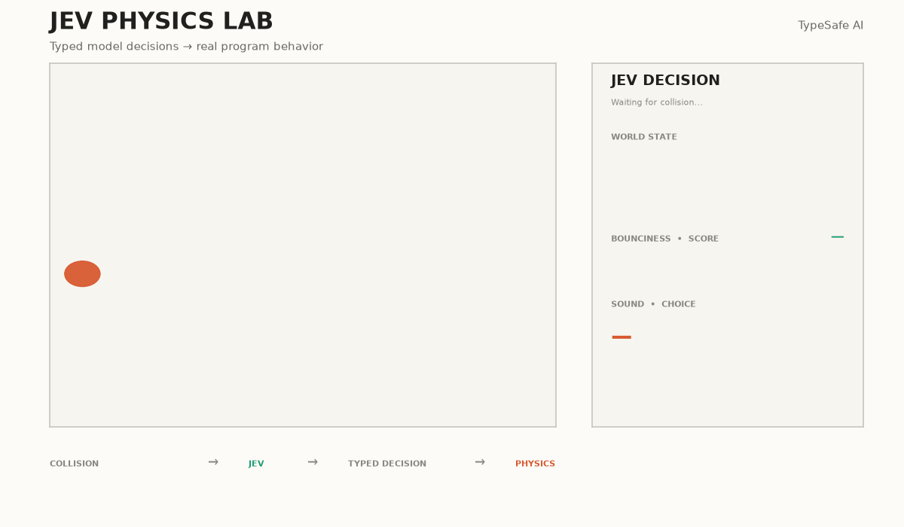

# Jev Physics Lab

A small physics experiment where **TypeSafe AI's Jev** makes typed decisions that directly control a running physics simulation.

Instead of using a hardcoded restitution value, the simulation asks Jev how a collision should behave.

## Demo



## How It Works

Every time the ball collides with a surface, the simulation creates a piece of world state such as:

```text
A soap bubble collides with an ice rink.
